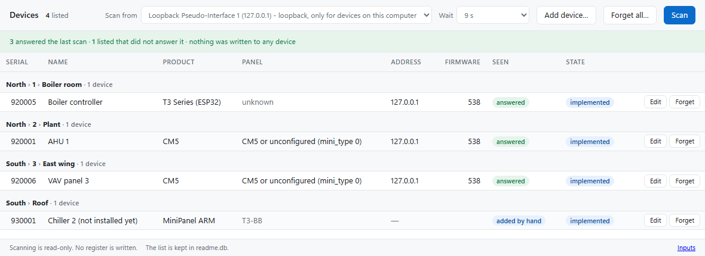
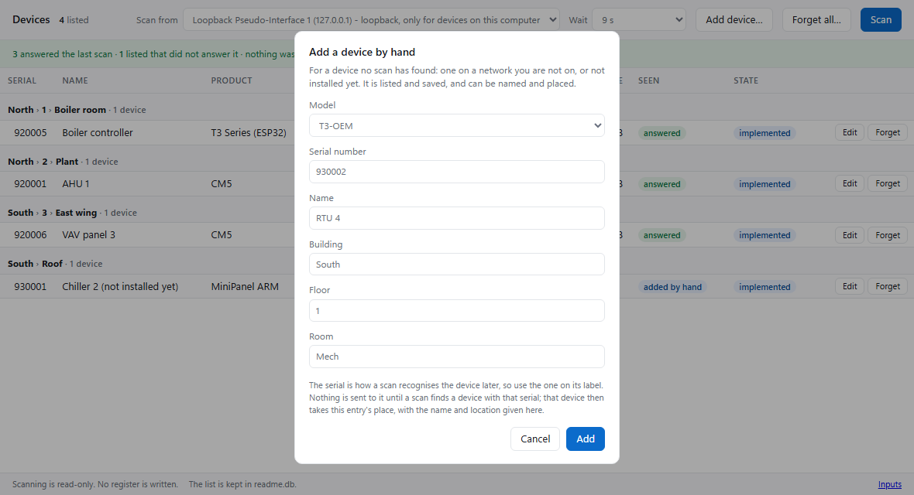
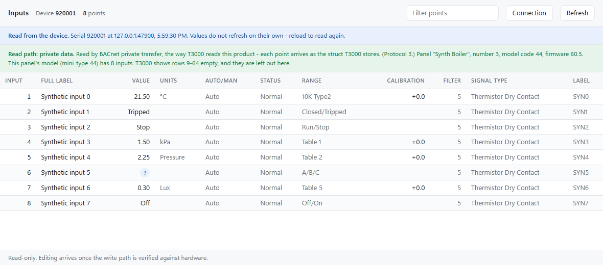
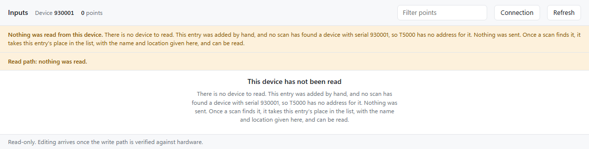

T3000 Building Automation System
================================

This is our T3000 Building Automation front end, a mature project for managing the air conditioning, lighting, access control and other automation functions of commercial buildings. The application runs on a Windows PC and allows the building operator to manage the building as a complete system. There is a small but growing team of developers working on the application full time. The system works mainly with Temco Controls products but integrators, controls contractors and other manufacturers are encouraged to join in to add their own devices and features. Communication is supported using Modbus and/or Bacnet calls over Ethernet, Wifi, RS485, RS232, and Bluetooth.  

The project has been around for many years and has a bright future as the system and our application matures. We welcome contributions and suggestions on next steps. Please refer to [Wiki](https://github.com/temcocontrols/T3000_Building_Automation_System/wiki) for details on how you can get started with contributing towards the project.  For build instructions see [Compile T3000](README_Build.md). See [Documentation](Documentation/README.md) for technical plans and integration guides.

To see how you can use our github release action in your own fork follow the instructions in our Wiki [How to use our github action to build the solution and the msi installer](https://github.com/temcocontrols/T3000_Building_Automation_System/wiki/How-to-use-our-github-action-to-build-the-solution-and-the-msi-installer)

Many of our products are open source, check them out on the [Temco Controls](http://www.temcocontrols.com/) web site. Most of what we do at Temco Controls is behind the scenes OEM work so feel free to send an email and ask for custom products. 

Regards,   
Maurice Duteau     
General Manager    
[Temco Controls](http://www.temcocontrols.com/)    
maurice (at) temcocontrols (dot) com


T5000: the new configuration tool
---------------------------------

[`T5000/`](T5000) is a new configuration tool, built to replace T3000's MFC user interface: every screen except the graphics editor, for every product family. It is one `T5000.exe` that serves its pages to your browser at `http://127.0.0.1:8730`, on this computer only. It builds on its own from `T5000\T5000.sln` and needs neither MFC nor .NET.

What it does so far:

* **Scans** the network interface you pick with T3000's discovery broadcast, and lists what answers. The scan is read-only. A problem it notices, such as two devices on one Modbus id or a device with no serial number, is shown as a repair for someone to approve later, and is never written.
* **Keeps a device list** in `T5000.db` between runs, with a name, building, floor and room for each device, grouped by them.
* **New: adds devices by hand.** A device no scan has found can be added with its model and serial number, then named and placed. The models are T3000's: T3-BB, T3-OEM, TSTAT10 and the rest of its Add virtual device list, then the other products. That covers a device on a network you are not on, or one not installed yet. Nothing is sent to it. When a scan finds a device with that serial, the device takes the entry's place in the list, keeping its name and location.
* **Reads a controller's Inputs** over BACnet/IP (CM5, MiniPanel, MiniPanel ARM, ESP32 T3 and TSTAT10), laid out column for column as T3000 shows them.

Being designed now:
* configuring a device added by hand while offline;
* virtual devices;
* finding and reading devices through COM ports (serial, USB and RS485).

Not built yet: writing to devices, the other screens, and Tstats and Modbus modules. [`T5000/README.md`](T5000/README.md) says where it stands, and [`docs/t5000-migration-plan.md`](docs/t5000-migration-plan.md) has the plan.

These screenshots are of T5000 on loopback against synthetic panels, not real equipment.



*The device list, grouped by building, floor and room. The last device was added by hand, and no scan has found it yet.*



*Adding a device that no scan has found.*



*A panel's inputs, read over BACnet/IP, with the panel's own custom range names.*



*A device added by hand has nothing to read, and nothing is sent to it.*

To build and run it:

```
"C:\Program Files\Microsoft Visual Studio\18\Community\MSBuild\Current\Bin\MSBuild.exe" "T5000\T5000.sln" -p:Platform=x86 -p:Configuration=Release
T5000\bin\Release\T5000.exe
```

`--no-browser` starts it without opening a browser, and `--db <file>` keeps the device list in another file. [`README_Build.md`](README_Build.md) has the details.


